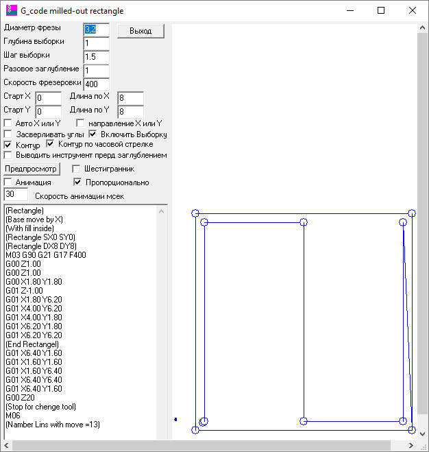
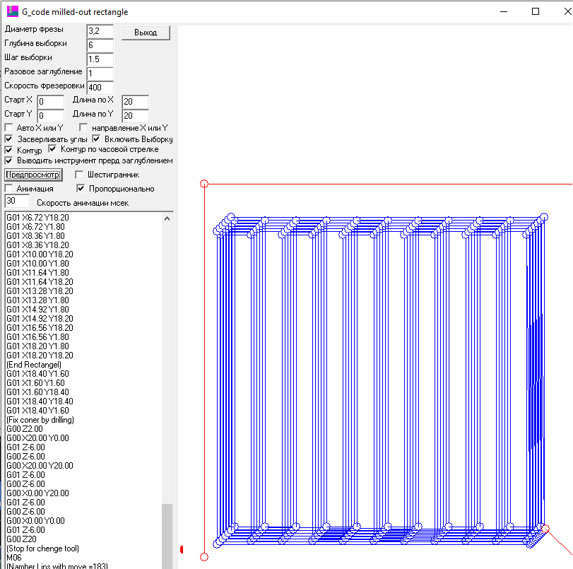
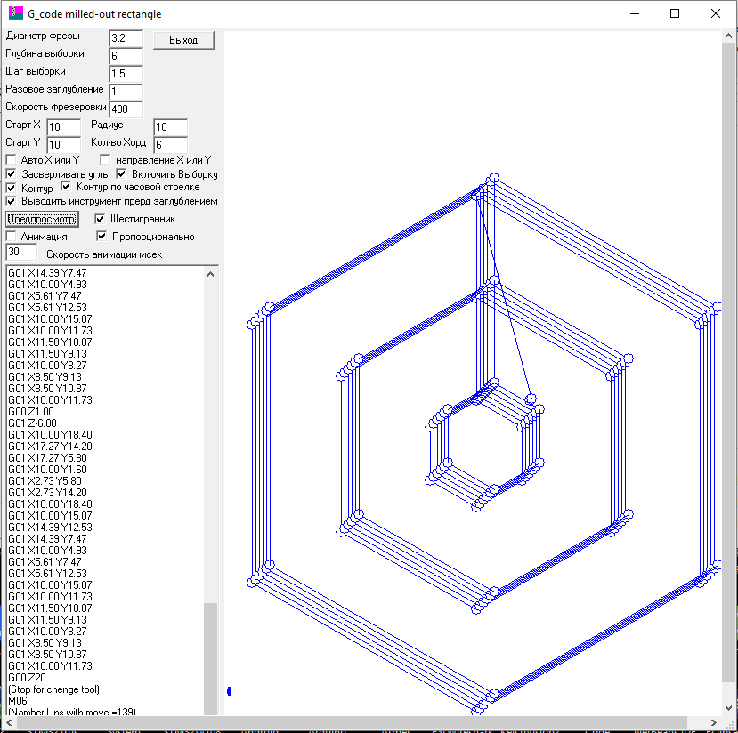

# CNC-Tools

### Tools to generate G-code by parameters
> ### Программа для генерации G-code по параметрам

 

This program CNC-Tools created using Delphi 6.0, the compiled program and sources included.
> Программа СNC-Tools создана на Delphi 6.0, скомилированная программа и исходные файлы прилагаются.

 

The program uses specified parameters to generate G-code for CNC machine. There are possibilities to select rectangular blocks or rectangular cuttings using specified contours. The programs doesnt checks any selection or or boundary conditions and therefore can lead to unexpected errors, so please be careful!
>Программа по заданным параметрам выдаёт G-code для станка с ЧПУ. Возможны варианты выборки прямоугольной ниши или вырезания прямоугольника по контуру. Программа не отслеживает ошибки и краевые условия и может из за них слетать, поэтому будьте внимательны!

 

The result shown in the bottom left window, you can select to copy for further usage in other CNC-related programs.
Результат выводится в нижнем левом окне, откуда его можно скопировать для дальнейшего использования в программе станка.

### Brief description / Краткое описание

* **Диаметр фрезы** - cutting tool diameter / диаметр режущего инструмента-фрезы

* **Глубина выборки** - depth of the total sample in the workpiece, sets the total depth of the sample
 / глубина общей выборки в заготовке, задаёт общую глубину выборки

* **Шаг выборки** - tool offset by X or Y, depending on the selected sampling orientation / шаг смещения инструмента по X или Y в зависимости от выбранной ориентации выполнения выборки

* **Разовое заглубление** - the depth at which the tool is immersed for milling the next layer of the workpiece / глубина на которую погружается инструмент для фрезерования следующего слоя заготовки
					  
* **Скорость фрезеровки** - the speed of movement of the cutter in the workpiece during cutting / скорость передвижения фрезы в заготовки во время резки

* **Старт X, Y** - sets the starting offset for the sample area / задаёт начальное смещение для области выборки

* **Длина по X, Y** - distance to be sampled / расстояние, на которое будет выполняться выборка

* **Авто X или Y** - the check mark switches on the mode of automatic selection of the prevailing sampling direction during milling / галочка включает режим автоматического выбора преобладающего направления выборки при фрезеровании

* **направление X или Y** - when checked the prevalence of the sample in X, unchecked - the predominance of the sample in Y / с галочкой - преобладание выборки по X, без галочки - преобладание выборки по Y

* **Засверливать углы** - if the checkbox is checked, then upon completion of the sample, the cutter drills the corners in a single pass of the sample / если стоит галочка, то по завершению выборки фреза засверливает за один проход выборки углы

* **Включить выборку** - if checked - a sample is performed inside the rectangle, otherwise the rectangle is simply cut along the contour / если стоит галочка, то выполняется выборка внутри прямоугольника, иначе просто вырезается прямоугольник по контуру

* **Контур** - a check mark leads to final contour milling for cleaner machining, if not checked - only the selection is performed. If not checked and "Enable selection" not checked too, then nothing is processed / установленная галочка приводит к финальному фрезерованию контура для более чистой обработки. Если не устанавливать галочку, то выполняется только выборку. Если нет галочки и не стоит галочка на Включить выборку, то ничего не обрабатывается

* **Выводить инструмент перед заглублением** - after one sample layer is completed, the tool is removed from the workpiece before the next treatment / после завершения одного слоя выборки инструмент выводится из заготовки перед следующей обработкой

* **Предпросмотр** - clicking a button performs data processing and creates a set of G-code commands for processing / нажатие на кнопку выполняет обработку данных и создает набор команд G-code для обработки

* **Шестигранник** - if a check mark is set, then the sample goes as for a hexagon / если установлена галочка, то выборка идёт как для шестигранника

* **Анимация** - if checked, upon completion of the preparation of commands, the processing process is slowly drawn. The interval between the lines in milliseconds is given below / если стоит галочка, то по завершению подготовки команд медленно прорисовывается процесс обработки. Интервал между линиями в миллисекундах задается ниже

* **Скорость анимации мсек** - delay in milliseconds when animating between drawing each command / задержка в миллисекундах при анимации между рисованиями каждой из команд

* **Примеры трассы выборок** - Large square sample / Большая квадратная выборка, Hex Sampling / Шестигранная выборка.

