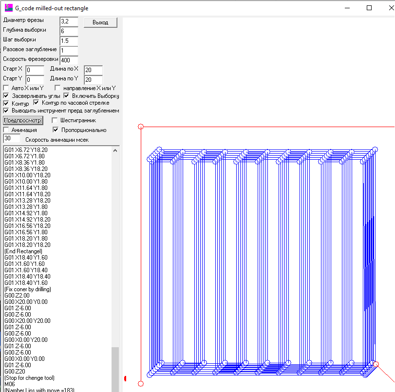

# PCB Drill Optimizer

Optimise le parcours de perçage pour la fabrication de circuits imprimés (PCB) en minimisant la distance de déplacement de la machine CNC. Fait partie de [CNC-Tools](https://github.com/Michael-VT/CNC-Tools).

## Fonctionnalités

- **Optimisation du parcours** — L'algorithme Nearest Neighbor + 2-opt minimise les déplacements non productifs
- **Analyseur Excellon** — Lit les fichiers de perçage standard au format Excellon NC (.drl, .xln, .exc)
- **Saisie manuelle** — Entrez les coordonnées des trous et les outils directement
- **Support multi-outils** — Groupe les trous par taille de foret, optimise chaque groupe, minimise les changements d'outil
- **Visualisation** — Aperçu du parcours sur canvas avec codage couleur par outil
- **Animation** — Animation pas à pas du parcours de perçage
- **Génération de G-code** — G-code de perçage CNC standard (compatible Grbl, Mach3, LinuxCNC)
- **Sortie modifiable** — Le G-code est modifiable avant l'enregistrement
- **Autonome** — Ouvrez `drill_optimizer.html` dans n'importe quel navigateur, aucun serveur requis
- **CLI Python** — Outil en ligne de commande pour le traitement par lots

## Application Web

Ouvrez `drill_optimizer.html` dans un navigateur. Aucune installation requise.

1. **Charger un fichier** — Glissez-déposez un fichier de perçage Excellon, ou cliquez pour parcourir
2. **Ou saisie manuelle** — Ajoutez des outils et des trous dans la section « Manual Input »
3. **Optimiser** — Cliquez sur « Optimize Path » pour calculer le parcours de perçage le plus court
4. **Visualiser** — Changez d'onglet : Original / Optimized / Comparison / Animation
5. **Générer** — Réglez les paramètres de perçage et cliquez sur « Generate G-code »
6. **Modifier et enregistrer** — Modifiez le G-code dans la zone de texte, puis Copiez ou Téléchargez le fichier .nc

### Capture d'écran



## CLI Python

```bash
cd python
python run.py ../tests/fixtures/sample_metric.drl --stats

# Avec des paramètres personnalisés
python run.py input.drl -o output.nc --feed 300 --plunge 80 --depth -1.8 --rpm 8000

# Aperçu avec matplotlib
python run.py input.drl --preview
```

### Options CLI

| Option | Par défaut | Description |
|--------|------------|-------------|
| `-o, --output` | stdout | Fichier G-code de sortie |
| `--feed` | 400 | Vitesse d'avance (mm/min) |
| `--plunge` | 100 | Vitesse de plongée (mm/min) |
| `--depth` | -2.0 | Profondeur de perçage (mm) |
| `--safe` | 20 | Hauteur de rétractation de sécurité (mm) |
| `--rpm` | 10000 | Vitesse de broche (RPM) |
| `--iter` | 200 | Itérations 2-opt |
| `--time-limit` | 5.0 | Limite de temps d'optimisation (secondes) |
| `--dwell` | off | Ajouter un temps d'attente au fond du trou |
| `--preview` | off | Afficher l'aperçu matplotlib |
| `--stats` | off | Afficher les statistiques d'optimisation |

## Format d'entrée

L'outil accepte les fichiers de perçage au format Excellon NC — le format standard pour les données de perçage de PCB. Fonctionnalités prises en charge :

- Unités métriques (`METRIC`) et impériales (`INCH`)
- Suppression des zéros non significatifs en tête (`LZ`) et en fin (`TZ`)
- Définitions d'outils : `T01C0.8` (outil 1, diamètre 0.8mm)
- Frappes de perçage : `X1000Y2000`
- Fentes : `G85X...Y...X...Y...`
- Détection automatique du format de coordonnées

## Algorithme d'optimisation

1. **Regroupement par outil** — Les trous sont regroupés par taille de foret pour minimiser les changements d'outil
2. **Nearest Neighbor** — La construction gloutonne visite les trous de chaque groupe en commençant par le plus proche
3. **Amélioration 2-opt** — Échange itératif de paires d'arêtes pour éliminer les croisements de parcours
4. **Ordre des groupes** — Les groupes d'outils sont séquencés pour minimiser les déplacements inter-groupes

## Format de sortie G-code

```
G21                          (Metric)
G90                          (Absolute positioning)
G00 Z20.000                  (Safe height)
T01
M06                          (Tool change)
M03 S10000                   (Spindle on)
G00 X10.000 Y5.000           (Rapid to hole)
G00 Z2.000                   (Approach)
G01 Z-2.000 F100             (Drill)
G00 Z2.000                   (Retract)
...
M05                          (Spindle off)
M30                          (End program)
```

## Exécution des tests

```bash
cd drill_optimizer
python -m pytest tests/test_optimizer.py -v
```

## Structure du projet

```
drill_optimizer/
  drill_optimizer.html        Application web (ouvrir dans le navigateur)
  js/                         Modules JavaScript
    excellon_parser.js        Analyseur de fichiers Excellon
    drill_optimizer.js        Optimisation NN + 2-opt
    gcode_generator.js        Génération de G-code
    visualization.js          Rendu sur canvas + animation
    app.js                    Contrôleur d'interface
  python/                     Outils CLI Python
    excellon_parser.py        Analyseur
    drill_optimizer.py        Optimiseur
    gcode_generator.py        Générateur de G-code
    run.py                    Point d'entrée CLI
  tests/                      Tests Python + données de test
```

## Licence

Fait partie de [CNC-Tools](https://github.com/Michael-VT/CNC-Tools).
