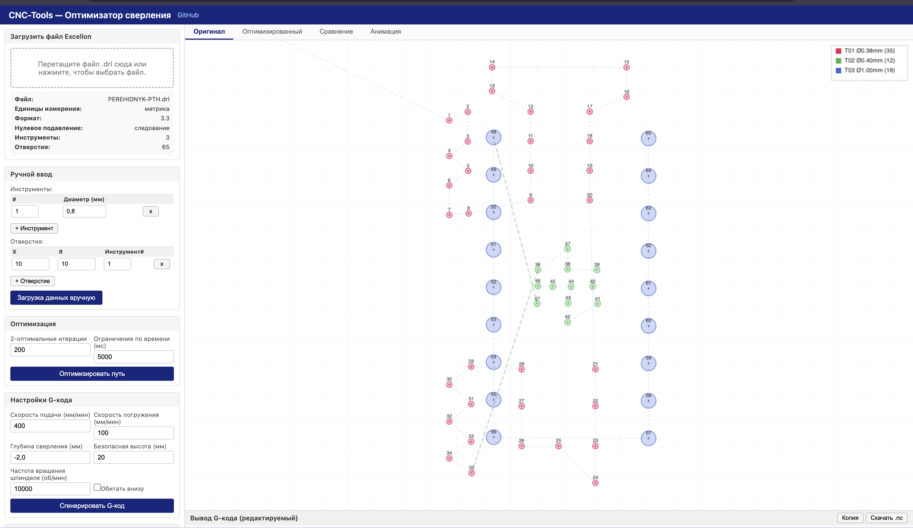
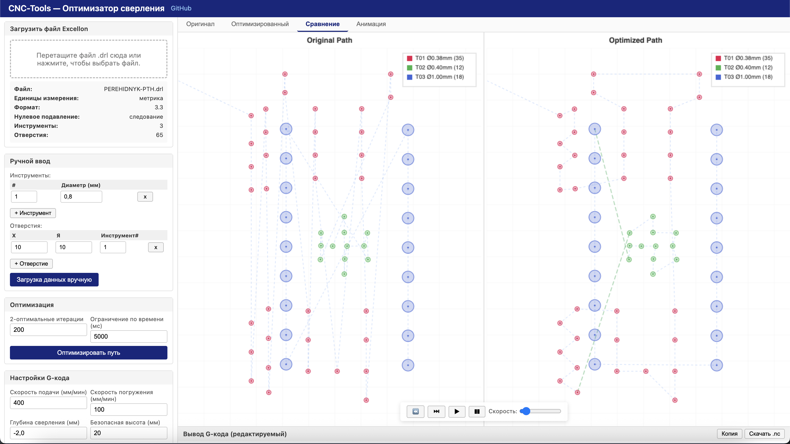

# PCB Drill Optimizer

**Documentation in other languages / Dokumentation in anderen Sprachen:**
[Українська](README.UA.md) | [Русский](README.RU.md) | [Português](README.PT.md) | [Deutsch](README.DE.md) | [Français](README.FR.md)

Optimizes drilling path for PCB manufacturing by minimizing CNC machine travel distance. Part of [CNC-Tools](https://github.com/Michael-VT/CNC-Tools).

## Features

- **Path optimization** — Nearest Neighbor + 2-opt algorithm minimizes non-productive travel
- **Excellon parser** — Reads standard Excellon NC drill files (.drl, .xln, .exc)
- **Manual input** — Enter hole coordinates and tools directly
- **Multi-tool support** — Groups holes by drill size, optimizes each group, minimizes tool changes
- **Visualization** — Canvas-based path preview with color-coded tools
- **Animation** — Step-by-step drill path animation
- **G-code generation** — Standard CNC drilling G-code (Grbl, Mach3, LinuxCNC compatible)
- **Editable output** — G-code is editable before saving
- **Standalone** — Open `drill_optimizer.html` in any browser, no server needed
- **Python CLI** — Command-line tool for batch processing

## Web Application

Open `drill_optimizer.html` in a browser. No installation required.

1. **Load file** — Drag & drop an Excellon drill file, or click to browse
2. **Or enter manually** — Add tools and holes in the "Manual Input" section
3. **Optimize** — Click "Optimize Path" to compute the shortest drilling route
4. **Visualize** — Switch tabs: Original / Optimized / Comparison / Animation
5. **Generate** — Set drilling parameters and click "Generate G-code"
6. **Edit & Save** — Edit the G-code in the text area, then Copy or Download .nc

### Screenshot




## Python CLI

```bash
cd python
python run.py ../tests/fixtures/sample_metric.drl --stats

# With custom parameters
python run.py input.drl -o output.nc --feed 300 --plunge 80 --depth -1.8 --rpm 8000

# Preview with matplotlib
python run.py input.drl --preview
```

### CLI Options

| Option | Default | Description |
|--------|---------|-------------|
| `-o, --output` | stdout | Output G-code file |
| `--feed` | 400 | Feed rate (mm/min) |
| `--plunge` | 100 | Plunge rate (mm/min) |
| `--depth` | -2.0 | Drill depth (mm) |
| `--safe` | 20 | Safe retract height (mm) |
| `--rpm` | 10000 | Spindle speed (RPM) |
| `--iter` | 200 | 2-opt iterations |
| `--time-limit` | 5.0 | Optimization time limit (seconds) |
| `--dwell` | off | Add dwell at drill bottom |
| `--preview` | off | Show matplotlib preview |
| `--stats` | off | Print optimization statistics |

## Input Format

The tool accepts Excellon NC drill files — the standard format for PCB drilling data. Supported features:

- Metric (`METRIC`) and Imperial (`INCH`) units
- Leading (`LZ`) and trailing (`TZ`) zero suppression
- Tool definitions: `T01C0.8` (tool 1, diameter 0.8mm)
- Drill hits: `X1000Y2000`
- Slots: `G85X...Y...X...Y...`
- Auto-detection of coordinate format

## Optimization Algorithm

1. **Group by tool** — Holes are grouped by drill size to minimize tool changes
2. **Nearest Neighbor** — Greedy construction visits each group's holes starting from the closest
3. **2-opt improvement** — Iteratively swaps edge pairs to remove path crossings
4. **Group ordering** — Tool groups are sequenced to minimize inter-group travel

## G-code Output Format

```
G21                          (Metric)
G90                          (Absolute positioning)
G00 Z20.000                  (Safe height)
T01
M06                          (Tool change)
M03 S10000                   (Spindle on)
G00 X10.000 Y5.000           (Rapid to hole)
G00 Z2.000                   (Approach)
G01 Z-2.000 F100             (Drill)
G00 Z2.000                   (Retract)
...
M05                          (Spindle off)
M30                          (End program)
```

## Running Tests

```bash
cd drill_optimizer
python -m pytest tests/test_optimizer.py -v
```

## Project Structure

```
drill_optimizer/
  drill_optimizer.html        Web application (open in browser)
  js/                         JavaScript modules
    excellon_parser.js        Excellon file parser
    drill_optimizer.js        NN + 2-opt optimization
    gcode_generator.js        G-code generation
    visualization.js          Canvas rendering + animation
    app.js                    UI controller
  python/                     Python CLI tools
    excellon_parser.py        Parser
    drill_optimizer.py        Optimizer
    gcode_generator.py        G-code generator
    run.py                    CLI entry point
  tests/                      Python tests + fixtures
```

## License

Part of [CNC-Tools](https://github.com/Michael-VT/CNC-Tools).
